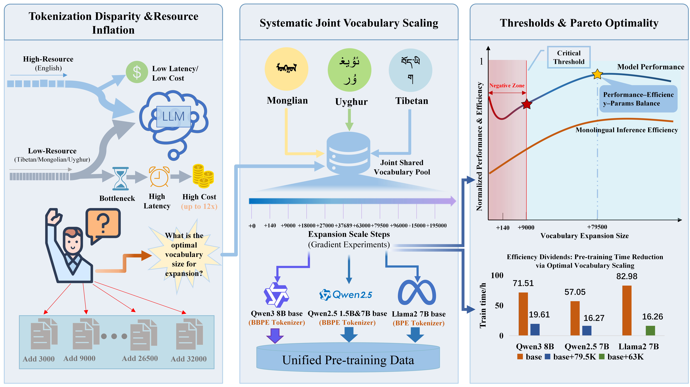
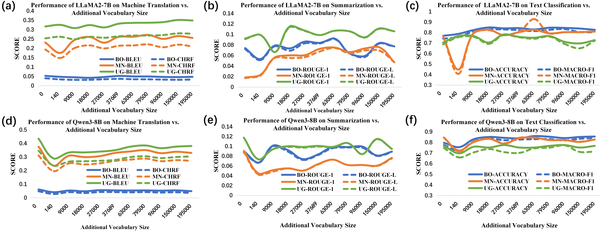

# Scaling Laws or Threshold Effects: Exploring the Optimal Vocabulary Size for Balancing Performance and Efficiency in Low-Resource Languages

[](#) <!-- 待论文上线后可替换链接 -->
[](https://www.modelscope.cn/collections/lingfeng2360/ACL-2026-Findings-Vocab-Scaling)
[](LICENSE)

This is the official repository for the paper: **"Scaling Laws or Threshold Effects: Exploring the Optimal Vocabulary Size for Balancing Performance and Efficiency in Low-Resource Languages"**, accepted by **ACL 2026 (Findings)**.

## 🌟 Key Contributions
We systematically investigate vocabulary scaling for three non-Latin-script, low-resource languages: **Mongolian**, **Tibetan**, and **Uyghur**. Our findings challenge the conventional monotonic scaling laws in Byte-level BPE (BBPE) architectures:

1.  **The BBPE Threshold Effect**: We identify a critical initiation threshold of **~9,000 total tokens** (3,000 per language). Below this, performance actually degrades due to representation instability.
2.  **Pareto-Optimal Configuration**: Through Pareto Frontier Analysis, we pinpoint **79,500 tokens** as the universal "sweet spot" for BBPE, reducing continual pre-training duration by **>71%** while enhancing performance.
3.  **Efficiency Paradox**: We reveal how oversized vocabularies can lead to an "efficiency backlash" in generative tasks due to embedding/Softmax layer overhead.



---

## 🚀 Model Zoo (Comprehensive Collection)

We have released all model checkpoints on **ModelScope**, covering different scaling levels (L1–L10), architectures, and training stages. 

### 🔗 [Click here to access the Full Model Collection](https://www.modelscope.cn/collections/lingfeng2360/ACL-2026-Findings-Vocab-Scaling)

### 📂 Collection Structure & Naming Convention
The collection includes **100+ checkpoints**. To find the specific model you need, please refer to the following naming pattern:
`{Architecture}-{Scale}-{Stage}-{Task}`

1.  **Architectures**: 
    * `Qwen3-8B`, `Qwen2.5-7B`, `Qwen2.5-1.5B` (BBPE-based)
    * `Llama2-7B` (BPE-based)
2.  **Vocabulary Scales**: 
    * `L1` (140 tokens) to `L10` (195,000 tokens). 
    * We highly recommend the **optimal 79.5k (L7)** configuration for BBPE models.
3.  **Stages & Tasks**:
    * **`IP`**: Incremental Pre-training (Backbones with expanded vocabulary).
    * **`SFT`**: Supervised Fine-tuning models.
    * **Tasks (for SFT)**: `MT` (Machine Translation), `TS` (Summarization), `TC` (Text Classification).

**Example**: `Qwen3-8B-79.5k-SFT-MT` refers to the Qwen3-8B model with a 79.5k vocabulary, fine-tuned for Machine Translation.

### 📊 Model Series Overview

| Model Type | Stages Available | Scaling Levels | Targeted Languages |
| :--- | :--- | :--- | :--- |
| **Qwen3-8B** | IP & SFT | L1 ~ L10 | Mongolian, Tibetan, Uyghur |
| **Qwen2.5-7B/1.5B** | IP & SFT | L1 ~ L10 | Mongolian, Tibetan, Uyghur |
| **Llama2-7B** | IP & SFT | L1 ~ L10 | Mongolian, Tibetan, Uyghur |

---

## 🛠️ Usage

### Installation
```bash
git clone https://github.com/White2360/vocab-scaling-low-resource.git
cd vocab-scaling-low-resource
pip install -r requirements.txt
```

### Loading Models via ModelScope
You can easily load any model from the collection. For example, to load the Pareto-optimal backbone:

```python
from modelscope import snapshot_download
from transformers import AutoModelForCausalLM, AutoTokenizer

# Replace the model ID with the one you selected from the collection
model_id = 'lingfeng2360/Qwen3-8B-79.5k-IP' 
model_dir = snapshot_download(model_id)

tokenizer = AutoTokenizer.from_pretrained(model_dir)
model = AutoModelForCausalLM.from_pretrained(model_dir, device_map="auto")
```

---

## 📊 Experimental Results
Our trilingual joint expansion strategy (JTE) significantly outperforms independent monolingual expansion (IME) in generative tasks:
- **Performance**: Mongolian (MN) achieved a +21.3% relative gain in MT (BLEU).
- **Efficiency**: Achieved over **2.0x throughput gains** on various monolingual tasks compared to base models.



---

## 🖋️ Citation
If you find our work or models useful, please cite our paper:

```bibtex
@inproceedings{vocab-scaling-acl2026,
  title={Scaling Laws or Threshold Effects: Exploring the Optimal Vocabulary Size for Balancing Performance and Efficiency in Low-Resource Languages},
  author={Han,Ao and Chen, Andong and Sun, Yuan and Zhao, Xiaobing},
  booktitle={Findings of the Association for Computational Linguistics: ACL 2026},
  year={2026}
}
```

---

## 🤝 Acknowledgements
We thank the contributors of the $MC^2$ dataset and the open-source communities of Qwen and Llama for their foundational models.
```
